# Introduction

Since [Heroku](https://www.heroku.com/) has removed the option of one free app for testing. We will try to deploy the application on a similar [Koyeb](https://www.koyeb.com/) service.

## **What is Koyeb?**

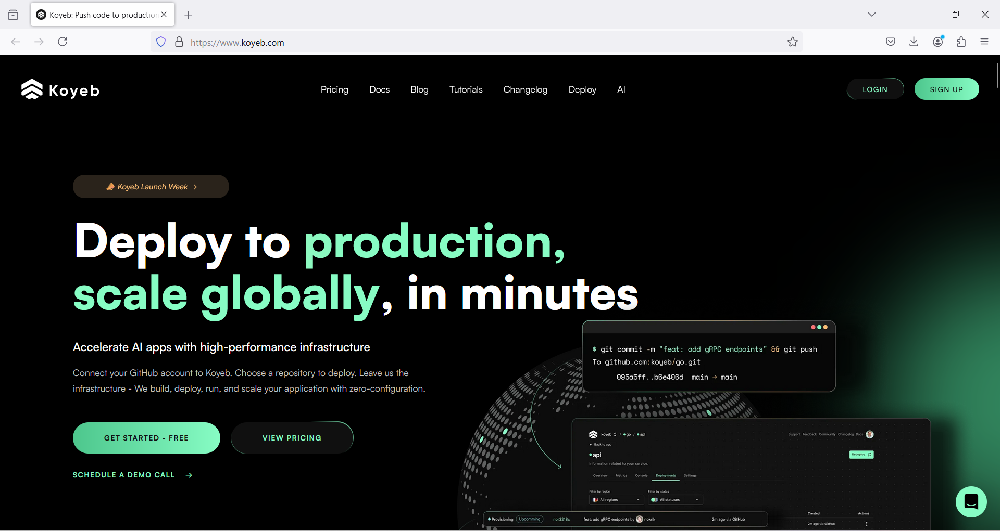

Koyeb is a developer-friendly serverless platform designed to let businesses easily deploy reliable and scalable applications globally. The platform has been created by Cloud Computing Veterans

and is financially backed by industry leaders.

Koyeb allows you to deploy all kind of services including full web applications, APIs, and background workers.

The platform provides a smooth developer experience with no cloud-specific technology. Applications can be deployed using standard Docker containers or directly from your git repositories. The platform comes with fast, continuous deployments and built-in versioning to deploy continuously and fearlessly.

Koyeb provides an efficient way to run apps without the heavy-duty tasks of building resilient and scalable infrastructure. All of the services you deploy on Koyeb come with native scaling and autohealing features to completely abstract the server layer. New service deployments are dramatically simplified thanks to a full-service mesh providing secure inter-service connection and automatic service discovery.

The core of the platform has been built with security and performance in mind. Applications transparently run in fast and secure Firecracker microVMs on top of bare metal servers with high-end CPUs.

Applications can be deployed globally with multiples locations and the Koyeb Edge Network provides a global CDN and load balancing.

We provide multiple configurations you can pick from based on the CPU and RAM requirements of your applications. We provide up to 16GB and 16 vCPU on the startup plan. Contact us if you need more!

To get you easily started we provide a free Instance that you can use to deploy a web Service with 512MB of RAM, 0.1 vCPU, and 2GB of SSD.

## ***Create your account***

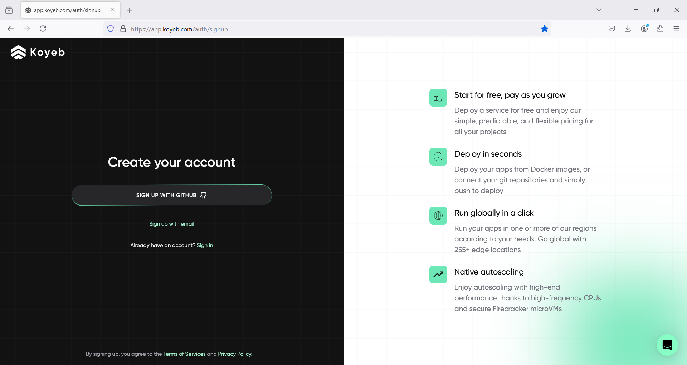

We will use the register via Github option.

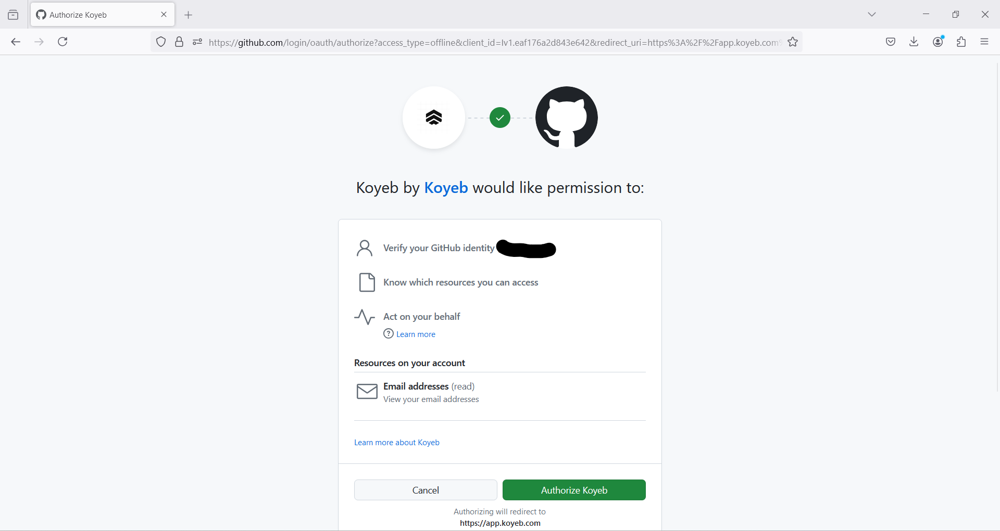
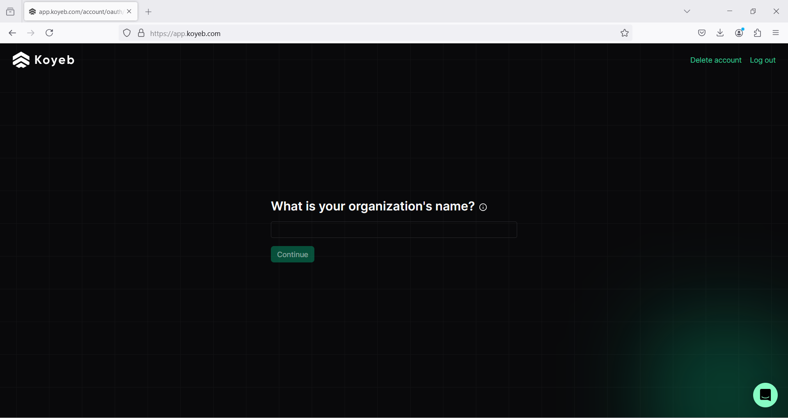
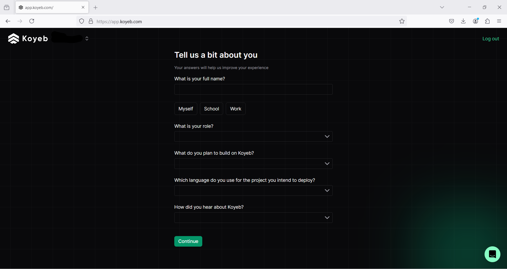

## ***Application Deployment***

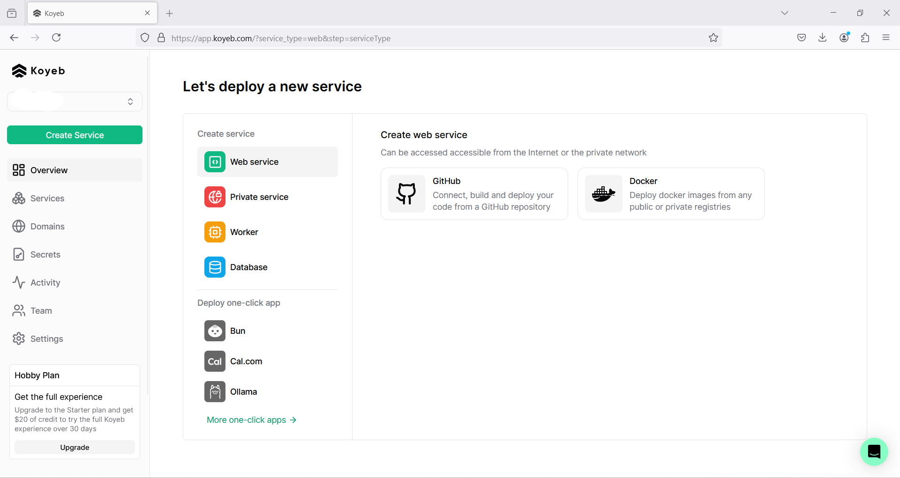

We will select the GitHub option.

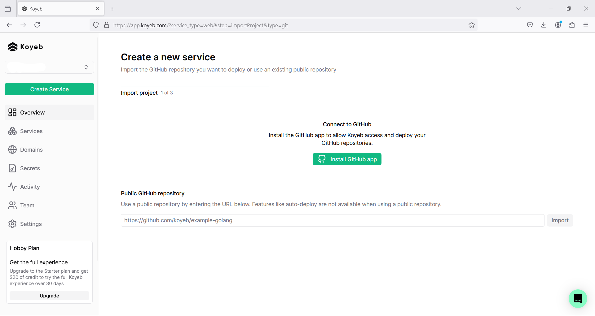
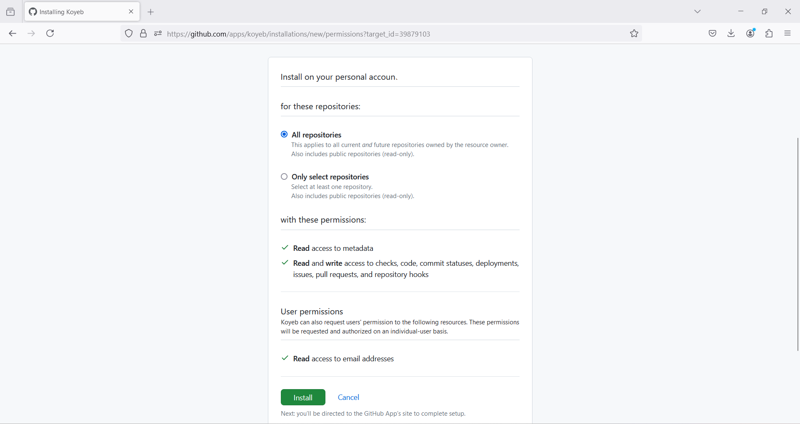
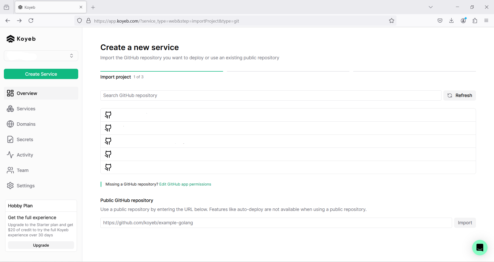

We select a project to deploy.

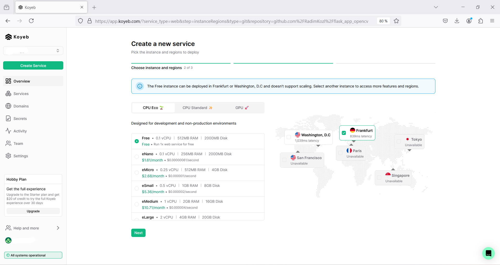
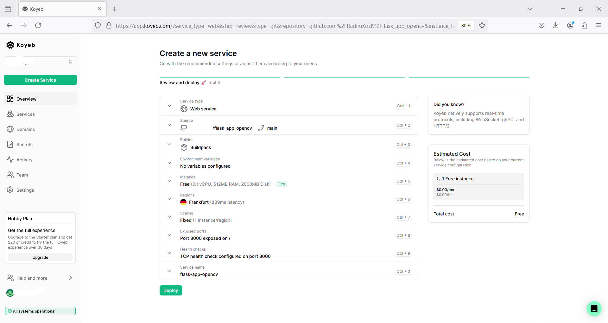

Now we'll set up a few things, we'll use a ***Dockerfile*** for deployment.

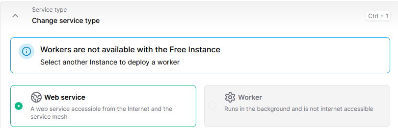
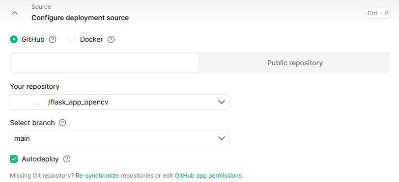
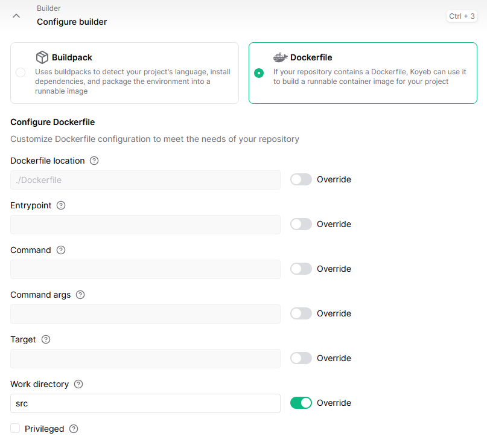

Now our web application can be deployed, the application link is at the top…

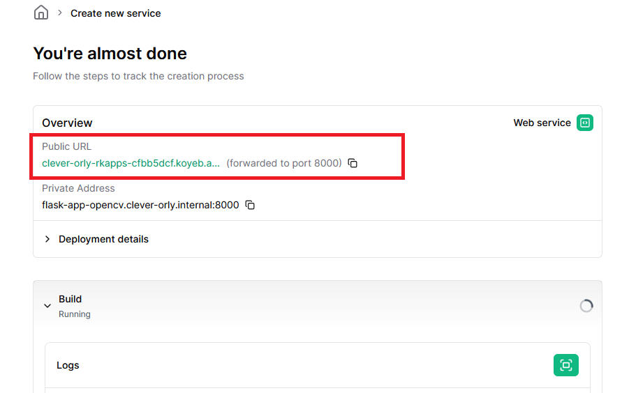

## ***References and other materials***

[Docker](https://www.docker.com/)

[Koyeb](https://www.koyeb.com/)

[Koyeb deploy](https://www.koyeb.com/docs/build-and-deploy/deploy-with-git)

